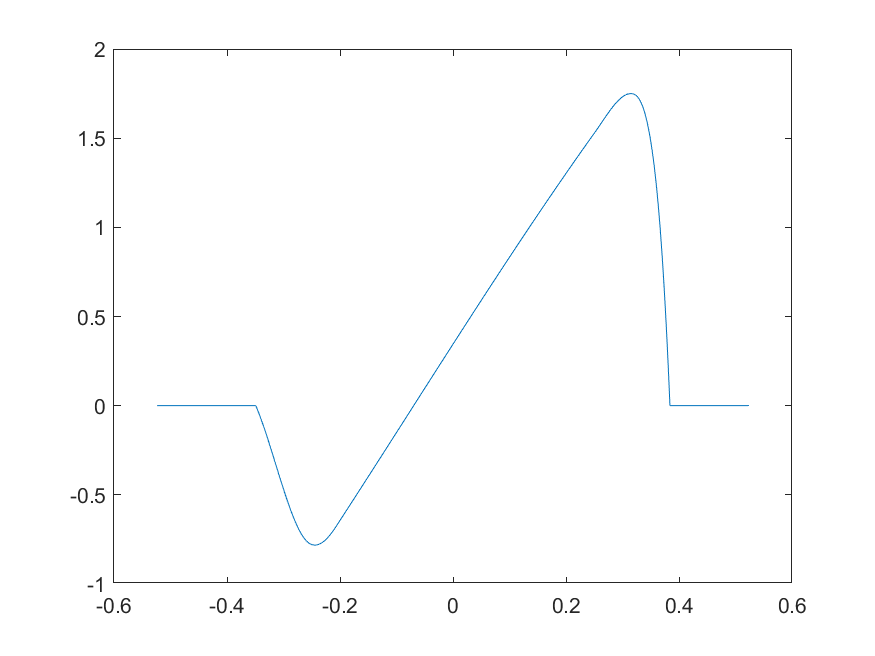
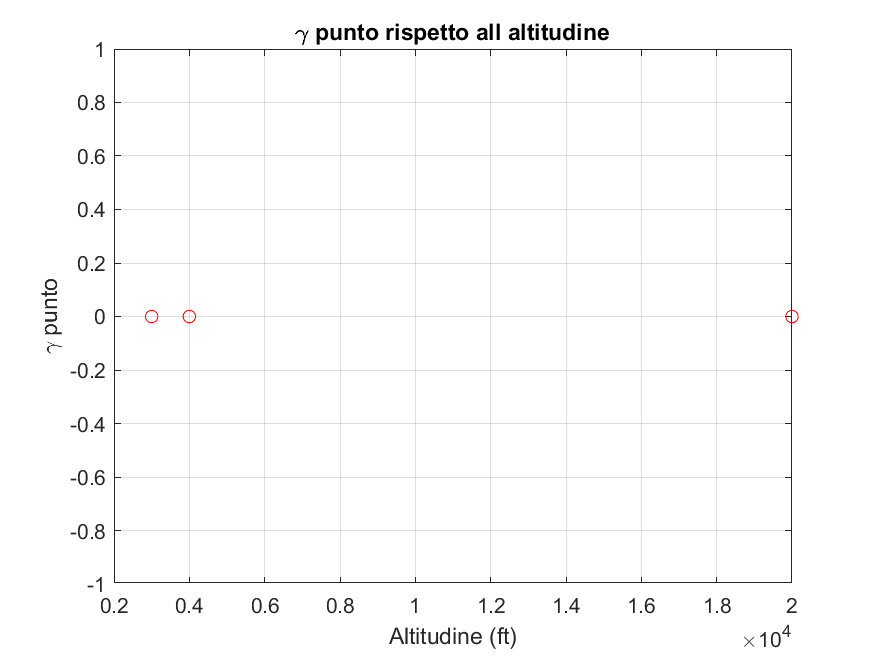
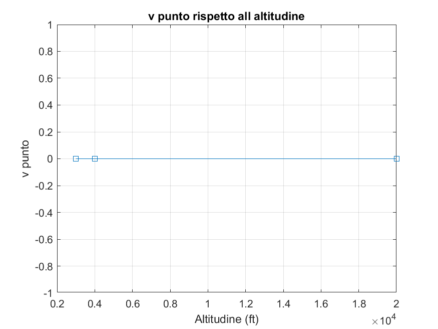
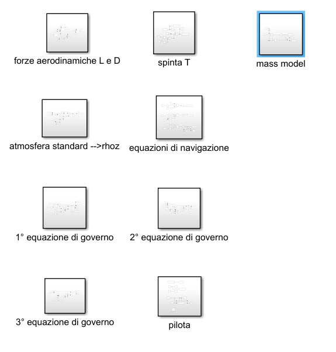

# Flight Trajectory Simulator – Cessna Citation C560 XLS
### Advanced Aircraft Trim & Performance Analysis (MATLAB + Simulink)

## Overview

This project presents a MATLAB and Simulink-based workflow for **flight performance analysis, trim computation, and validation** of a business jet aircraft, specifically the **Cessna Citation C560 XLS**.

This project presents a **comprehensive flight trajectory simulation framework** combining:

- **Aerodynamic modeling**
- **Aircraft trim computation**
- **Performance validation**
- **Dynamic simulation (Simulink)**
- **Real flight simulator data integration**

The workflow replicates a **real aerospace engineering pipeline**, moving from theoretical modeling to dynamic simulation and validation.

---

##  Objectives

- Compute **aircraft trim conditions** under different flight regimes  
- Analyze **aerodynamic performance vs altitude and Mach number**  
- Validate results through **parametric studies**  
- Simulate aircraft dynamics using **Simulink models**  
- Compare results with **real simulator datasets**

---

##  Project Architecture

MATLAB Scripts → Trim Conditions → Simulink Model → Dynamic Simulation
↓
Aerodynamic Data (Cl-α)
↓
Real Simulator Data (Validation)

## Workflow

To correctly run the project, follow this sequence:

### 1. Lift Curve Analysis
Run:
cl_alpha.m

- Loads experimental aerodynamic data
- Generates the **Cl vs α (angle of attack)** curve
- Defines valid interpolation range for later computations

---

### 2. Validation & Verification
Run:
verifica_validazione.m

- Evaluates aircraft performance across:
  - Multiple altitudes
  - Different Mach numbers
  - Various Oswald efficiency factors
- Computes:
  - Lift (L)
  - Drag (D)
  - Thrust (T)
  - Velocity rate (v̇)
  - Flight path angle rate (γ̇)
- Outputs:
  - Tables of results
  - Performance plots

---

### 3. Performance Variation (Bank Angle Effect)
Run:
cambio_performance.m

- Same analysis as validation step
- Introduces a **non-zero bank angle (φ ≠ 0)**
- Highlights how asymmetric flight conditions affect:
  - Aerodynamic forces
  - Stability
  - Required thrust

---

### 4. Trim Condition Simulation
Run:
simulazione_trimmaggio.m

- Computes **trim conditions** for steady flight
- Includes:
  - Standard atmosphere model
  - Speed calculation via Mach number
  - Aircraft aerodynamic model
- Outputs:
  - Trim angle of attack
  - Required thrust
  - Control parameters

---

### 5. Simulink Model
Open and run:
simulatore.slx

- Uses trim data as input
- Simulates aircraft dynamic response
- Provides time evolution of flight variables

---

##  MATLAB Numerical Simulation

The MATLAB environment is used to model the aircraft and compute trim conditions.

###  Key Features

- Lift coefficient interpolation from experimental data  
- Iterative trim algorithm  
- Atmospheric model (ISA)  
- Aerodynamic drag modeling  
- Multi-condition performance analysis  

---

###  Lift Curve (Cl vs α)

This curve is used for interpolation during the trim computation process.

---

###  Performance Results

#### γ̇ (Flight Path Angle Rate) vs Altitude

  
  

- Evaluates **flight stability**
- Verifies **trim convergence**
- Highlights performance variation with altitude

---

##  Trim Algorithm

The trim condition is computed iteratively by solving:

- Lift equilibrium  
- Drag balance  
- Thrust requirement  

The algorithm converges using:

- Interpolation of aerodynamic coefficients  
- Constraint bounding (Cl limits)  
- Iterative refinement of angle of attack  

---

##  Parametric Analysis

Two configurations are tested:

### 1. Straight Flight
- Bank angle: φ = 0°

### 2. Banked Flight
- Bank angle: φ ≠ 0°

This allows evaluation of:

- Load factor variation  
- Required thrust changes  
- Stability differences  

---

##  Simulink Dynamic Simulation

A full **dynamic flight model** is implemented in Simulink using trim conditions computed in MATLAB.

###  Features

- Time-domain simulation  
- Aircraft longitudinal dynamics  
- Thrust and aerodynamic coupling  
- Response to perturbations  

---

##  Real Flight Simulator Data Integration

This project includes **real data from a university flight simulator**.

###  Purpose

- Validate theoretical models  
- Compare simulated vs real behavior  
- Improve model credibility  

---

##  Flight Test Card

The flight test card summarizes:

- Test conditions  
- Validation scenarios  
- Performance checkpoints  

---

### Test Objectives
- Evaluate aircraft performance as a function of:
  - Altitude
  - Mach number
  - Oswald efficiency factor
  - Bank angle (φ)

### Measured Parameters
- Lift (L)
- Drag (D)
- Thrust (T)
- Velocity rate (v̇)
- Flight path angle rate (γ̇)
- Angle of attack (α)

This structured approach mirrors real-world **flight testing procedures** used in aerospace engineering.

---

## Results

The simulations show that:

- The **Oswald efficiency factor (e)** strongly influences aerodynamic efficiency:
  - Higher e → lower induced drag → improved performance
- Increasing Mach number:
  - Slightly increases lift
  - Significantly increases drag
- At higher altitudes:
  - Lift decreases due to reduced air density
- When **φ ≠ 0 (banked flight)**:
  - Aerodynamic forces increase
  - Additional thrust is required
- Under trim conditions:
  - Velocity and flight path angle rates approach zero (steady flight)

---

## Assumptions and Limitations

This model is based on several simplifying assumptions:

- Ideal jet propulsion system
- Constant fuel consumption
- Linear temperature gradient (ISA approximation)
- Two-dimensional aerodynamic model
- Rigid aircraft structure
- No unsteady aerodynamic effects

These assumptions make the model suitable for **educational and preliminary analysis**, but not for high-fidelity flight simulation.

---

## Technologies Used

- MATLAB
- Simulink
- Numerical methods (iterative solvers)
- Aerodynamic interpolation
- Standard atmosphere modeling

---

## Author

Simone Muscolino  
Aerospace Engineering Student  

---

## Notes

This project was developed as part of an aerospace simulation and flight dynamics study.  
It aims to demonstrate a structured approach to **flight performance analysis and validation using MATLAB and Simulink**.
